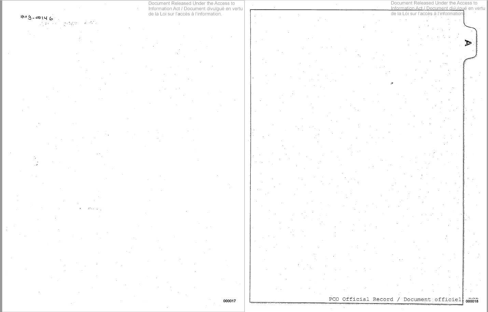

# FOI basics

_FOI, or early 20th-century suprematist artwork? Source: [Dylan Robertson, 2018](https://twitter.com/withfilesfrom/status/1040271200675606528)_

A short presentation on the basics of filing freedom of information requests in Canada. The slides can be found here: https://tomcardoso.github.io/foi-basics/

- [Full tipsheet](https://docs.google.com/document/d/1gD_mcXhp_uonu5g88oFcGm-ZibmPW2CF9zL64BRJQmw/)
- [ATIPster, a bookmarklet for filing federal access to information requests](https://tomcardoso.github.io/atipster/)
- [Piggyback, a bookmarklet for requesting previously-released federal requests](https://tomcardoso.github.io/piggyback/)
- [FOI Tracking sheet](https://docs.google.com/spreadsheets/d/1dKy_NL2X_u6IQhBPAy7ZFvvqYcvi5m3G4u8bB3P-hpc/)
